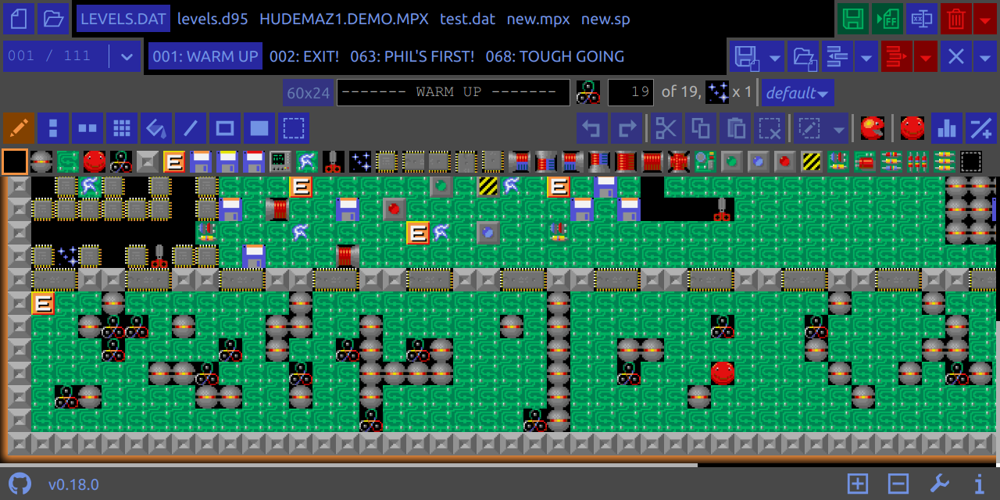

# SpLE

[][sple.me]

 

SpLE is **Supaplex Levels Editor**. Inspired by [Supaplex.Online][spo] and its
community.

My previous editor (Winplex Collection Editor — WpColEd) is stuck in far 2010 on
Windows. Its source code was lost somewhere in 2016 or about that with HDD
failure. And so, here it is: yet another Supaplex levels editor!

**SpLE** comes in two forms:

- [sple.me][sple.me] is a web app;
- Desktop version.

> **SpLE** is under development still. Feel free to report bugs, suggest
> enhancements and correct grammar mistakes.

## [sple.me][sple.me] Important notes

[sple.me][sple.me] is completely frontend (client side) application (web page).
It works only with pseudo-files in browser memory.

- After you opened existing file, it becomes in-memory copy of the original
  file. Technically you are uploading your local file to a web page.
- In-memory files you opened or created from scratch are NOT related to regular
  files out of browser.
- To get your modified file back as regular file technically you need to
  download file from web page (with appropriate UI button in
  [sple.me][sple.me]).

Also:

- [sple.me][sple.me] application uses `indexedDB` and `localStorage` for better
  user experience. These things are similar to well known _Cookies_ in terms of
  privacy.

  [sple.me][sple.me] will try to remember your modified in-memory files and some
  preferences in browser storage for better user experience.

- There are no intention to send any kind of your data to somewhere without your
  confirmation.

  [sple.me][sple.me] when completely loaded is operating locally in your
  browser. Neither external storages, nor cross-device sync are implied, nor
  planned.

  [sple.me][sple.me] uses [Supaplex.Online test page][spo.test] to test your
  level when you request that.

- DON'T rely much on browser storage to remember your modified in-memory files
  forever. DO SAVE BACKUPS. Browser can clean its storage.

  Also, [sple.me][sple.me] storage in browser can be accidentally reset in case
  of some errors in **SpLE** itself. Because, you know: _Every program has at
  least one bug_.

## Desktop SpLE

Desktop version of **SpLE** built using [Wails][wails]. It uses the same source
code as web app [sple.me][sple.me] to render frontend, but with some different
backend bindings to work with its host binary in desktop environment.

**Desktop SpLE** compared to [sple.me][sple.me] _DOES_ work with regular files
on your device, like other whatever desktop editors do.

## Planned features (unsorted)

- More features from Winplex Collection Editor.
- Compare levels.
- End User Manual.
- Draggable files buttons to reorder many opened files.
- See more in [TODO](./TODO.md).

## Contribution, Development

Project root directory was bootstrapped with [Wails][wails].

Frontend common app is now located in `./frontend/` subdirectory. It was
bootstrapped with [Create React App][cra]. Web [sple.me][sple.me] built from
that.

- To run Desktop SpLE in live development mode, run `wails dev` in the project
  directory.
- To run Web SpLE in live development mode, run `npm start` in `./frontend`
  subdirectory.

[cra]: https://github.com/facebook/create-react-app
[sple.me]: https://sple.me
[spo]: https://www.supaplex.online/
[spo.test]: https://www.supaplex.online/test/
[wails]: https://wails.io
