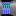
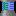
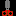
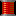
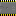
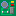
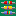
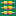

Copyright © 1991(?) [The Supaplex](http://www.elmerproductions.com/sp/) and
its original graphics by [Elmer Productions](http://www.elmerproductions.com/).

SVG tiles was written manually by Vovan-VE (me) at November 2021 in `*.tsx`.

Converted from `*.tsx` to regular `*.svg` at August 2022.

| hex | file                                                                                          | preview                                                                                                                                                                                                           |
| --- | --------------------------------------------------------------------------------------------- | ----------------------------------------------------------------------------------------------------------------------------------------------------------------------------------------------------------------- |
| 01  | [`01-zonk.svg`](./01-zonk.svg)                                                                |                                                                                                                                  |
| 02  | [`02-base.svg`](./02-base.svg)                                                                |                                                                                                                                  |
| 03  | [`03-murphy.svg`](./03-murphy.svg)                                                            |                                                                                                                            |
| 04  | [`04-infotron.svg`](./04-infotron.svg)                                                        |                                                                                                                      |
| 05  | [`05-chip.svg`](./05-chip.svg)                                                                |                                                                                                                                  |
| 06  | [`06-hardware.svg`](./06-hardware.svg)                                                        |                                                                                                                      |
| 07  | [`07-exit.svg`](./07-exit.svg)                                                                |                                                                                                                                  |
| 08  | [`08-orange-disk.svg`](./08-orange-disk.svg)                                                  |                                                                                                             |
| 09  | [`09-port-r.svg`](./09-port-r.svg)                                                            |                                                                                                                            |
| 0a  | [`0a-port-d.svg`](./0a-port-d.svg)                                                            |                                                                                                                            |
| 0b  | [`0b-port-l.svg`](./0b-port-l.svg)                                                            |                                                                                                                            |
| 0c  | [`0c-port-u.svg`](./0c-port-u.svg)                                                            |                                                                                                                            |
| 0d  | [`0d-spec-port-r.svg`](./0d-spec-port-r.svg)                                                  |                                                                                                             |
| 0e  | [`0e-spec-port-d.svg`](./0e-spec-port-d.svg)                                                  |                                                                                                             |
| 0f  | [`0f-spec-port-l.svg`](./0f-spec-port-l.svg)                                                  |                                                                                                             |
| 10  | [`10-spec-port-u.svg`](./10-spec-port-u.svg)                                                  |                                                                                                             |
| 11  | [`11-snik-snak.svg`](./11-snik-snak.svg)                                                      |                                                                                                                   |
| 12  | [`12-yellow-disk.svg`](./12-yellow-disk.svg)                                                  |                                                                                                             |
| 13  | [`13-terminal.svg`](./13-terminal.svg)                                                        |                                                                                                                      |
| 14  | [`14-red-disk.svg`](./14-red-disk.svg)                                                        |                                                                                                                      |
| 15  | [`15-port-vertical.svg`](./15-port-vertical.svg)                                              |                                                                                                       |
| 16  | [`16-port-horizontal.svg`](./16-port-horizontal.svg)                                          |                                                                                                 |
| 17  | [`17-port-cross.svg`](./17-port-cross.svg)                                                    |                                                                                                                |
| 18  | [`18-electron.svg`](./18-electron.svg)                                                        |                                                                                                                      |
| 19  | [`19-bug.svg`](./19-bug.svg)                                                                  |                                                                                                                                     |
| 1a  | [`1a-chip-left.svg`](./1a-chip-left.svg) [`1a-chip-left.2.svg`](./1a-chip-left.2.svg)         |               |
| 1b  | [`1b-chip-right.svg`](./1b-chip-right.svg) [`1b-chip-right.2.svg`](./1b-chip-right.2.svg)     |         |
| 1c  | [`1c-hw-circular.svg`](./1c-hw-circular.svg)                                                  |                                                                                                             |
| 1d  | [`1d-hw-g-lamp.svg`](./1d-hw-g-lamp.svg)                                                      |                                                                                                                   |
| 1e  | [`1e-hw-b-lamp.svg`](./1e-hw-b-lamp.svg)                                                      |                                                                                                                   |
| 1f  | [`1f-hw-r-lamp.svg`](./1f-hw-r-lamp.svg)                                                      |                                                                                                                   |
| 20  | [`20-hw-stripes.svg`](./20-hw-stripes.svg)                                                    |                                                                                                                |
| 21  | [`21-hw-res.svg`](./21-hw-res.svg)                                                            |                                                                                                                            |
| 22  | [`22-hw-cap.svg`](./22-hw-cap.svg)                                                            |                                                                                                                            |
| 23  | [`23-hw-res-var.svg`](./23-hw-res-var.svg)                                                    |                                                                                                                |
| 24  | [`24-hw-res-vert.svg`](./24-hw-res-vert.svg)                                                  |                                                                                                             |
| 25  | [`25-hw-res-horz.svg`](./25-hw-res-horz.svg)                                                  |                                                                                                             |
| 26  | [`26-chip-top.svg`](./26-chip-top.svg) [`26-chip-top.2.svg`](./26-chip-top.2.svg)             |                     |
| 27  | [`27-chip-bottom.svg`](./27-chip-bottom.svg) [`27-chip-bottom.2.svg`](./27-chip-bottom.2.svg) |   |
| 28  | [`28-invis-wall.svg`](./28-invis-wall.svg)                                                    |                                                                                                                |
| \-  | [`unknown.svg`](./unknown.svg)                                                                |                                                                                                                                  |
