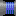
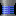
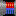
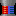
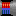
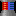

Copyright © 1991(?) [The Supaplex](http://www.elmerproductions.com/sp/) and
its original graphics by [Elmer Productions](http://www.elmerproductions.com/)(?)

SVG tiles was written manually by Vovan-VE (me) at November 2021 in `*.tsx`.

Converted from `*.tsx` to regular `*.svg` at August 2022.

| dec | hex | file                                                                                                   | preview                                                                                                                                                                                                                       |
| --- | --- | ------------------------------------------------------------------------------------------------------ | ----------------------------------------------------------------------------------------------------------------------------------------------------------------------------------------------------------------------------- |
| 01  | 01  | [`01-01-zonk.svg`](./01-01-zonk.svg)                                                                   |                                                                                                                                        |
| 02  | 02  | [`02-02-base.svg`](./02-02-base.svg)                                                                   |                                                                                                                                        |
| 03  | 03  | [`03-03-murphy.svg`](./03-03-murphy.svg)                                                               |                                                                                                                                  |
| 04  | 04  | [`04-04-infotron.svg`](./04-04-infotron.svg)                                                           |                                                                                                                            |
| 05  | 05  | [`05-05-chip.svg`](./05-05-chip.svg)                                                                   |                                                                                                                                        |
| 06  | 06  | [`06-06-hardware.svg`](./06-06-hardware.svg)                                                           |                                                                                                                            |
| 07  | 07  | [`07-07-exit.svg`](./07-07-exit.svg)                                                                   |                                                                                                                                        |
| 08  | 08  | [`08-08-orange-disk.svg`](./08-08-orange-disk.svg)                                                     |                                                                                                                   |
| 09  | 09  | [`09-09-port-r.svg`](./09-09-port-r.svg)                                                               |                                                                                                                                  |
| 10  | 0a  | [`10-0a-port-d.svg`](./10-0a-port-d.svg)                                                               |                                                                                                                                  |
| 11  | 0b  | [`11-0b-port-l.svg`](./11-0b-port-l.svg)                                                               |                                                                                                                                  |
| 12  | 0c  | [`12-0c-port-u.svg`](./12-0c-port-u.svg)                                                               |                                                                                                                                  |
| 13  | 0d  | [`13-0d-spec-port-r.svg`](./13-0d-spec-port-r.svg)                                                     |                                                                                                                   |
| 14  | 0e  | [`14-0e-spec-port-d.svg`](./14-0e-spec-port-d.svg)                                                     |                                                                                                                   |
| 15  | 0f  | [`15-0f-spec-port-l.svg`](./15-0f-spec-port-l.svg)                                                     |                                                                                                                   |
| 16  | 10  | [`16-10-spec-port-u.svg`](./16-10-spec-port-u.svg)                                                     |                                                                                                                   |
| 17  | 11  | [`17-11-snik-snak.svg`](./17-11-snik-snak.svg)                                                         |                                                                                                                         |
| 18  | 12  | [`18-12-yellow-disk.svg`](./18-12-yellow-disk.svg)                                                     |                                                                                                                   |
| 19  | 13  | [`19-13-terminal.svg`](./19-13-terminal.svg)                                                           |                                                                                                                            |
| 20  | 14  | [`20-14-red-disk.svg`](./20-14-red-disk.svg)                                                           |                                                                                                                            |
| 21  | 15  | [`21-15-port-vertical.svg`](./21-15-port-vertical.svg)                                                 |                                                                                                             |
| 22  | 16  | [`22-16-port-horizontal.svg`](./22-16-port-horizontal.svg)                                             |                                                                                                       |
| 23  | 17  | [`23-17-port-cross.svg`](./23-17-port-cross.svg)                                                       |                                                                                                                      |
| 24  | 18  | [`24-18-electron.svg`](./24-18-electron.svg)                                                           |                                                                                                                            |
| 25  | 19  | [`25-19-bug.svg`](./25-19-bug.svg)                                                                     |                                                                                                                                           |
| 26  | 1a  | [`26-1a-chip-left.svg`](./26-1a-chip-left.svg) [`1a-chip-left.2.svg`](./26-1a-chip-left.2.svg)         |               |
| 27  | 1b  | [`27-1b-chip-right.svg`](./27-1b-chip-right.svg) [`1b-chip-right.2.svg`](./27-1b-chip-right.2.svg)     |         |
| 28  | 1c  | [`28-1c-hw-circular.svg`](./28-1c-hw-circular.svg)                                                     |                                                                                                                   |
| 29  | 1d  | [`29-1d-hw-g-lamp.svg`](./29-1d-hw-g-lamp.svg)                                                         |                                                                                                                         |
| 30  | 1e  | [`30-1e-hw-b-lamp.svg`](./30-1e-hw-b-lamp.svg)                                                         |                                                                                                                         |
| 31  | 1f  | [`31-1f-hw-r-lamp.svg`](./31-1f-hw-r-lamp.svg)                                                         |                                                                                                                         |
| 32  | 20  | [`32-20-hw-stripes.svg`](./32-20-hw-stripes.svg)                                                       |                                                                                                                      |
| 33  | 21  | [`33-21-hw-res.svg`](./33-21-hw-res.svg)                                                               |                                                                                                                                  |
| 34  | 22  | [`34-22-hw-cap.svg`](./34-22-hw-cap.svg)                                                               |                                                                                                                                  |
| 35  | 23  | [`35-23-hw-res-var.svg`](./35-23-hw-res-var.svg)                                                       |                                                                                                                      |
| 36  | 24  | [`36-24-hw-res-vert.svg`](./36-24-hw-res-vert.svg)                                                     |                                                                                                                   |
| 37  | 25  | [`37-25-hw-res-horz.svg`](./37-25-hw-res-horz.svg)                                                     |                                                                                                                   |
| 38  | 26  | [`38-26-chip-top.svg`](./38-26-chip-top.svg) [`26-chip-top.2.svg`](./38-26-chip-top.2.svg)             |                     |
| 39  | 27  | [`39-27-chip-bottom.svg`](./39-27-chip-bottom.svg) [`27-chip-bottom.2.svg`](./39-27-chip-bottom.2.svg) |   |
| 40  | 28  | [`40-28-invis-wall.svg`](./40-28-invis-wall.svg)                                                       |                                                                                                                      |
| \-  | \-  | [`unknown.svg`](./unknown.svg)                                                                         |                                                                                                                                              |
| \-  | \-  | [`meta-port-r.svg`](./meta-port-r.svg)                                                                 |                                                                                                                              |
| \-  | \-  | [`meta-port-d.svg`](./meta-port-d.svg)                                                                 |                                                                                                                               |
| \-  | \-  | [`meta-port-l.svg`](./meta-port-l.svg)                                                                 |                                                                                                                               |
| \-  | \-  | [`meta-port-u.svg`](./meta-port-u.svg)                                                                 |                                                                                                                                 |
